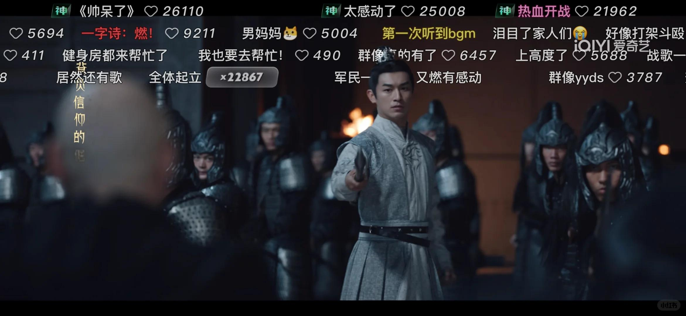
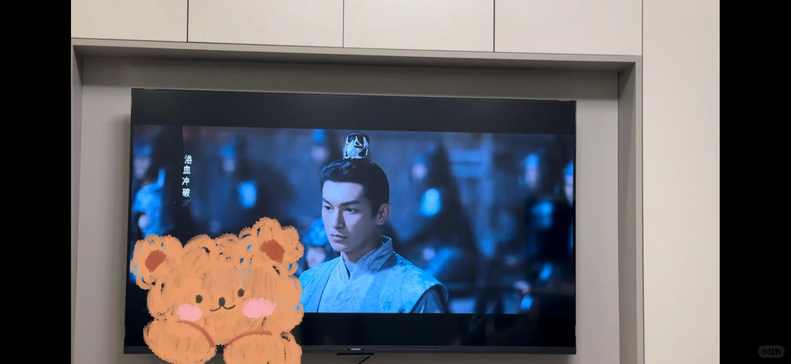
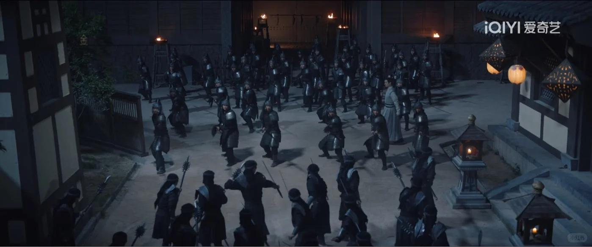
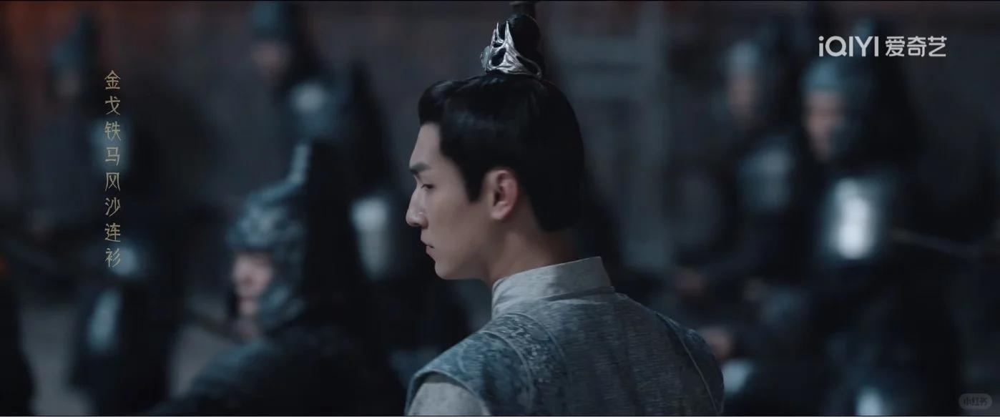
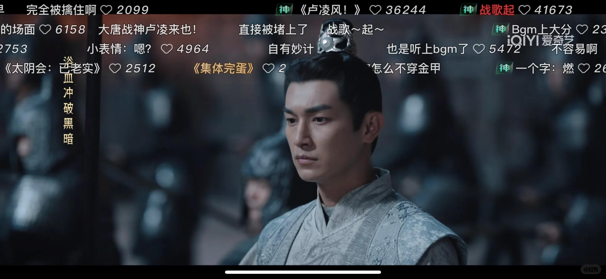

# 小卢真帅！！！终于可以继续追唐诡2～

之前唐诡2追到《仵作之死》就没看了～狂赚我眼泪
今天追到了《通天犀》，有点普通，另外我居然没发现姜威的演员是李汶翰 第三个案子的打戏超级帅气
小卢这集出来真的帅炸了，第一次听到bgm挥枪的时候一身浩然正气。这段也就看了四遍吧～
不过我觉得从风摩店到千重渡到通天犀，推理的过程都变弱了，虽然诡谲但是每个人的身份都自曝而且太好猜了（卷宗居然能记载到被救走到山里，被姓宋的猎户收养，妥妥就猜到是谁了）且看后面，看帖子说后面的好看！
 
我每次看剧看电影喜欢1.5倍速，实在是感觉说话慢了而且太长了被我室友吐槽说太快了，还说我喜欢快进以后不能跟我一起看了哈哈哈……可是不好看的地方真的忍不住跳，当然好看的地方我能平速看三四遍唐诡3快来！
#唐朝诡事录之西行 #唐诡2 #卢凌风