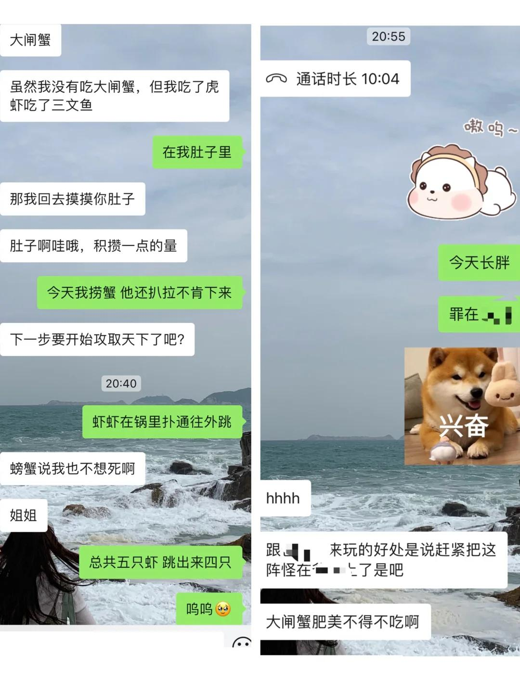
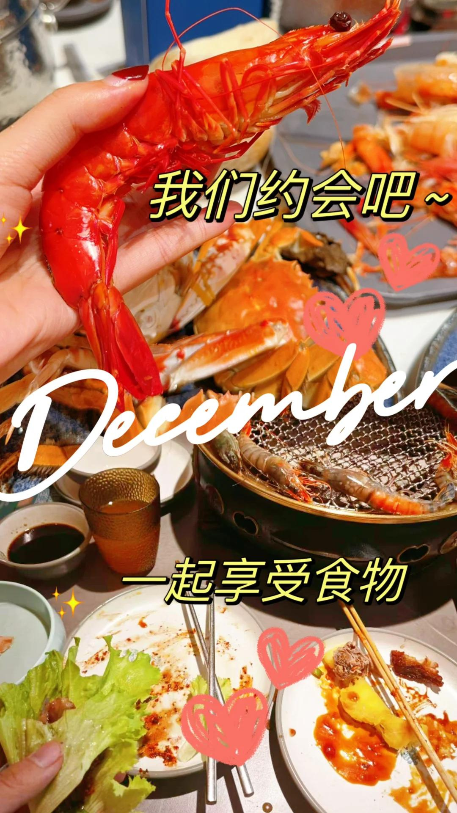
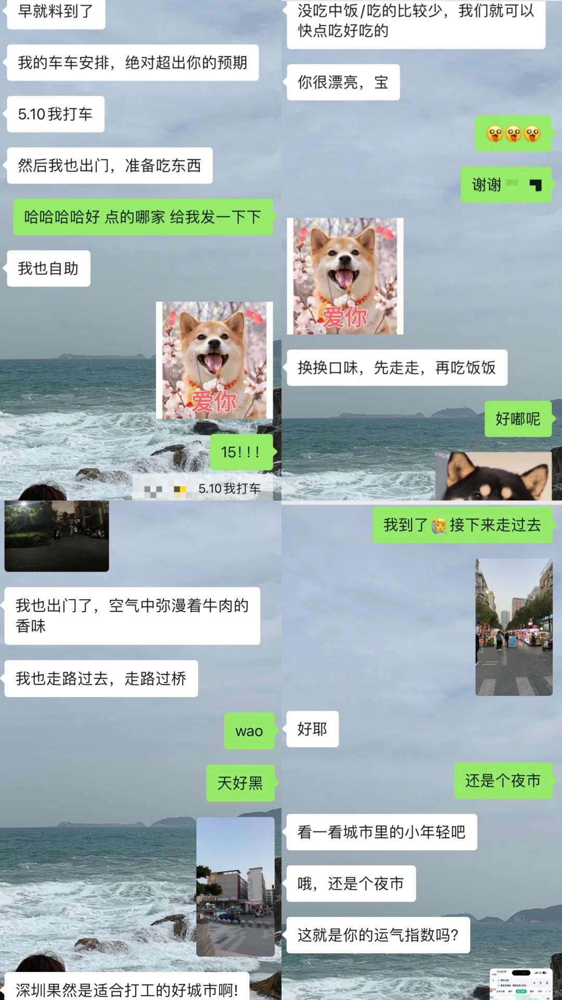
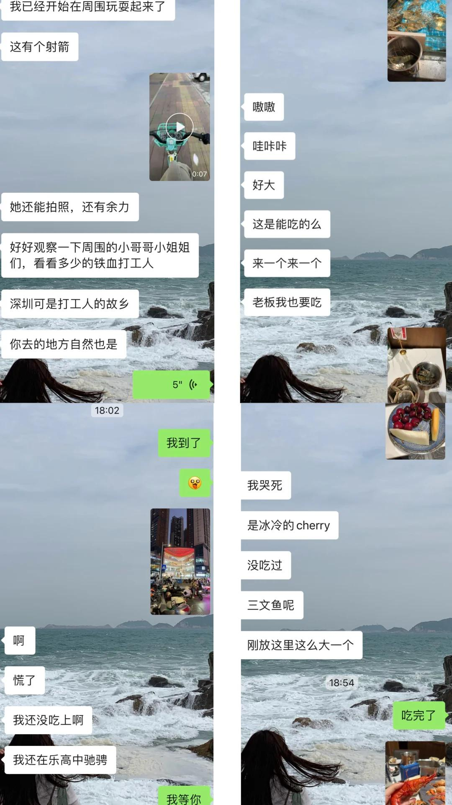
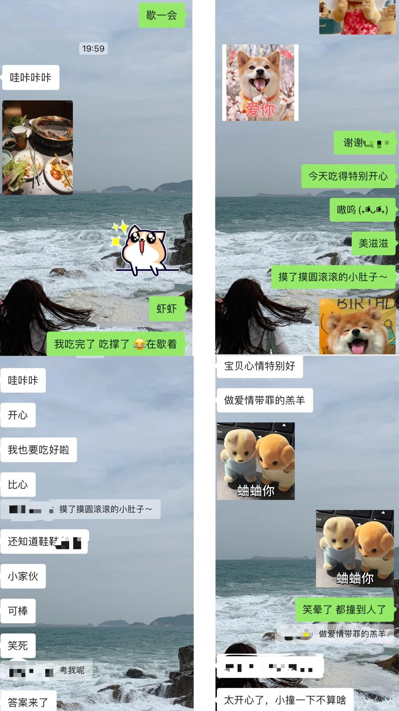

# 异地恋的远程约会(☆_☆)

上海和深圳，1400+公里的距离，
异地恋，我们的爱情也很甜蜜
慵懒的周末，男朋友安排了一个surprise～
前脚两个人刚各自在床上视频电话完，
后脚让我准备出门，吃点好吃饭，我？
给我安排了一顿海鲜自助大餐，他也会去吃自助，
小小的身体弱弱的反抗了一下（完全吃不了多少呀）
但是男朋友想让我快乐开心那就不纠结，去啦！
两个人出发的时候告诉对方～觅食约会开始啦！
—————————————————————————
 
上海天黑的好早，深圳还是亮亮的
本以为坐车直奔目的地就好了！结果！这男人！
一、给我安排了几个途径点让我看沿路风景
司机：你要接人吗？我：啊？不是就我一个人
男朋友：我就安排几个标记，继续开
我：……//司机：…… 沉默再沉默🤐
司机内心：这两口子会玩会玩，离谱的很～
二、目的地不是餐厅而在某个夜市停下，让我多走路
我一看下车地方2.2km走路要30mins，人都傻了，
果然选择了骑单车，呼啦啦开始做有氧～
我的座位在一个拐角，有四个桌子，两对情侣一对朋友，我一个人库库开始准备，如果是之前我一定会觉得一个人来吃饭会很无聊，有些孤独，但是这次完全不会因为我知道他在陪着我，我们互相陪伴～share各自的美食！
【今天吃了好多蟹蟹和虾虾，大闸蟹梭子蟹花蟹，黑虎虾罗氏虾九节虾……各种贝类菌类，几乎都是海鲜🦞🦀】
笑死，控制饮食控制体重我今天破戒啦，晚上回来也拉肚肚，但是很开心！很幸福！很高兴～很甜蜜
 
男朋友经常说：我没有什么异地恋的感觉，你就好像一直在我身边。我也是！
异地恋会比其他情侣更加想念彼此，但是也会更加珍惜彼此，更加想要努力为对方创造快乐，我们不会去找对方爱自己的痕迹，我们确信对方深爱着自己！也会更加期盼每次见面，上次见面还是国庆，还好再有十几天就可以见面啦同事打趣：你这两个月都靠这见面几天活了吧，三天恐怕不够吧，要不请一个月
好爱好爱我的男朋友，要记录我们幸福的瞬间！快乐的生活！说了很多很多次，但是2024最大的幸运就是和男朋友在一起，是我的福报
#每天都有值得记录的瞬间 #异地恋 #爱情应该有的样子 #记录我的生活 #恋爱