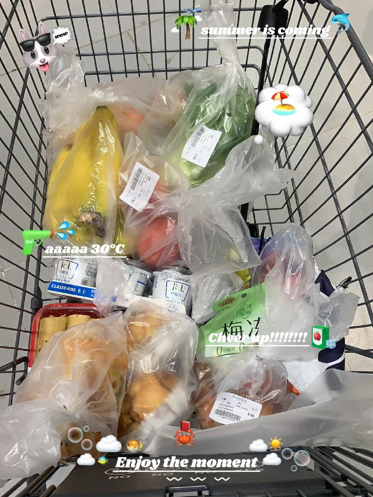

# 我一直都被好好爱着～爱我的父母！

#想记录下此刻 #逛超市 #生活碎片 #原生家庭
去超市补给路过熟食柜想着买个烤鸡腿，
前面一男一女（兄妹or情侣？）在挑选，
两人一直在纠结买什么，我就在后面排队，
空手没有购物车没有购物篮没买任何东西，
纠结七八分钟最后只拿了一只炸鸡腿（5元），
有些诧异，那一刻突然就觉得生活挺不容易，
基本日常吃喝也不是谁都可以随随便便消费。
看家长带小孩买零食，一包薯片or一袋饼干，
想到以前每次我爸带我去超市都是满满当当
十几年前去都是消费200起大部分买零食酸奶，
别人送的永辉超市乐天玛特金鹰大润发的卡，
我家也都是给卡我去买零食想吃什么就买，那个时候网购也没这么普及，不看价格就买买买，真的很幸福！一直都有被好好爱着～现在也是！