# 日腐剧/日腐电影推荐安利！都给我哭！

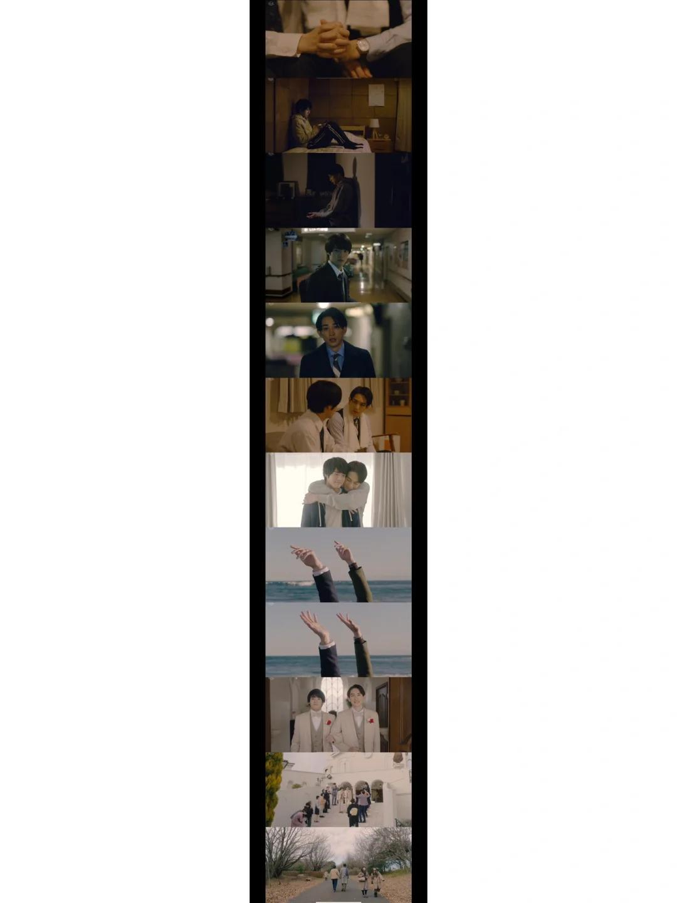
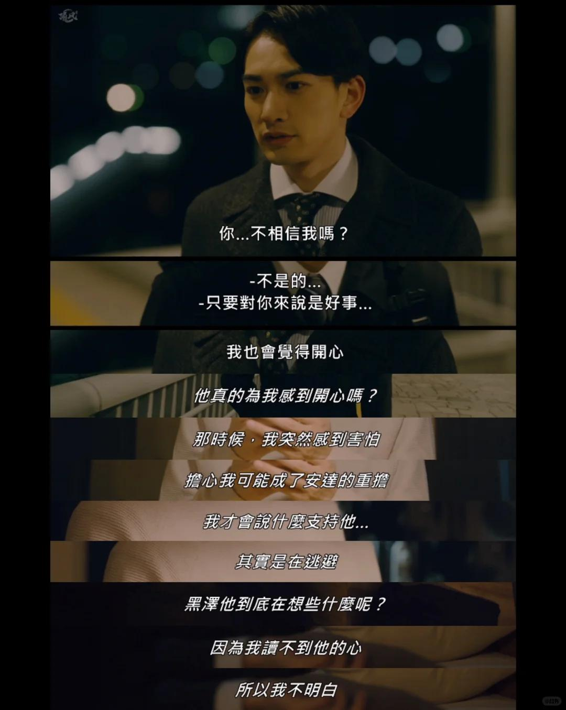
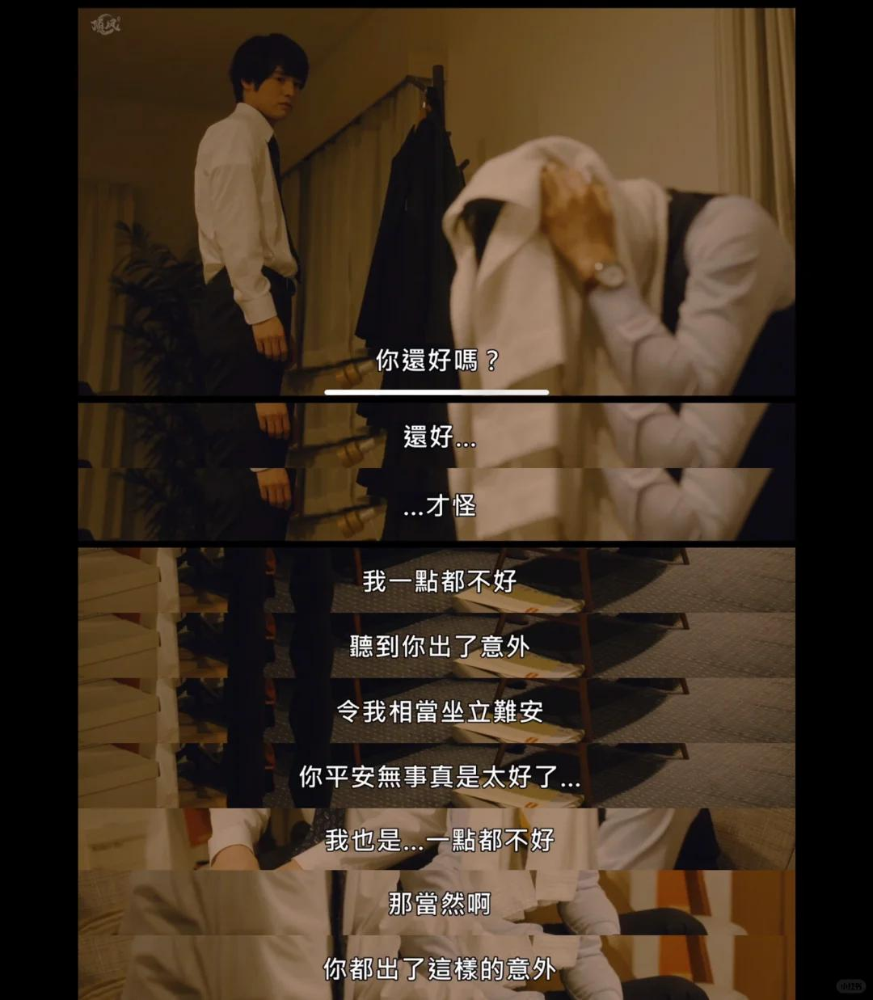
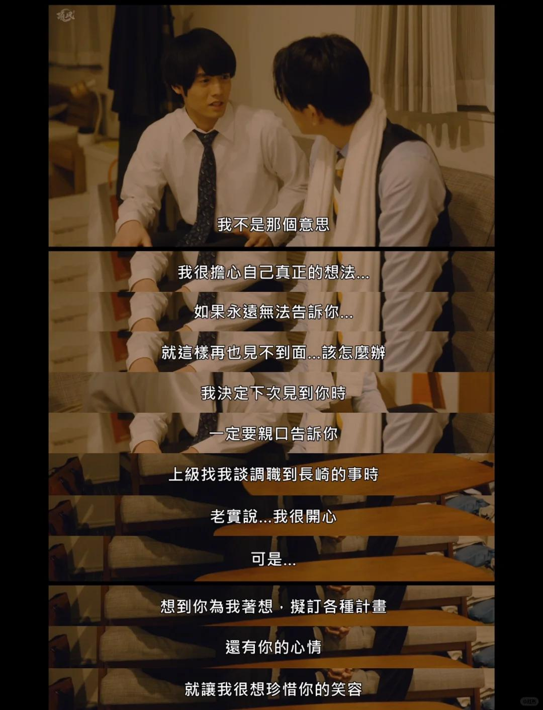
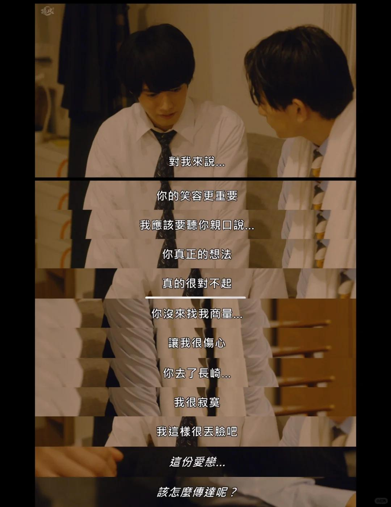
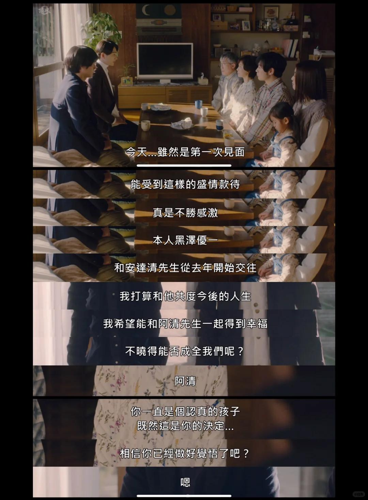
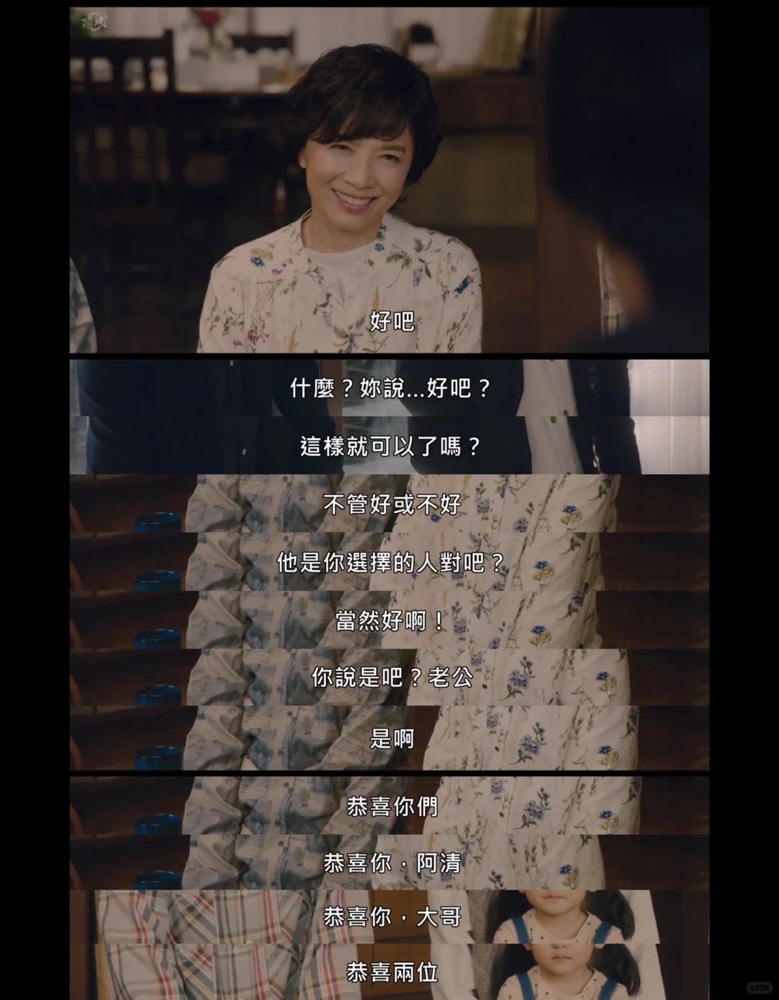
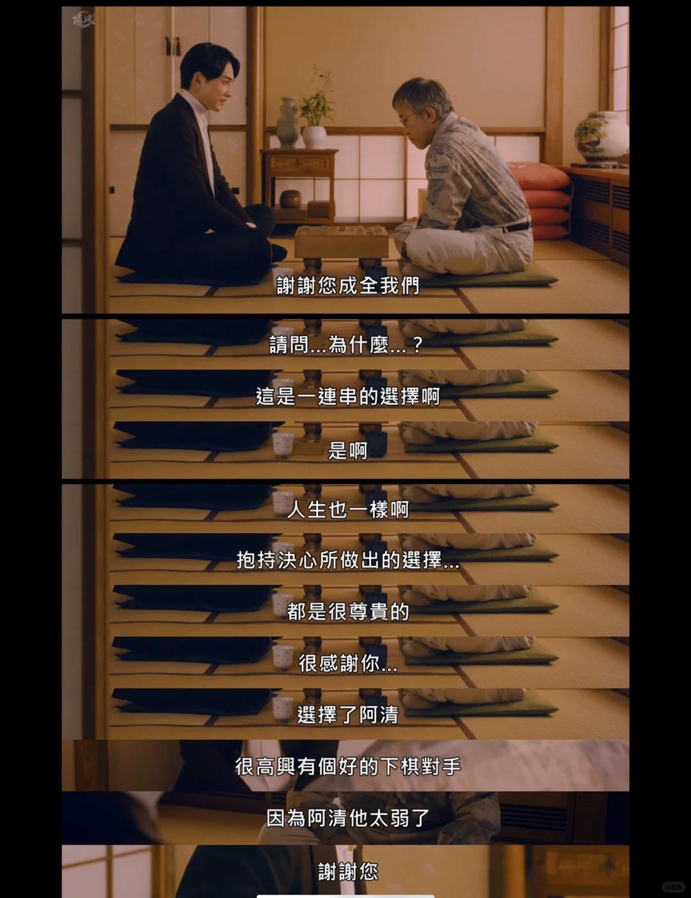
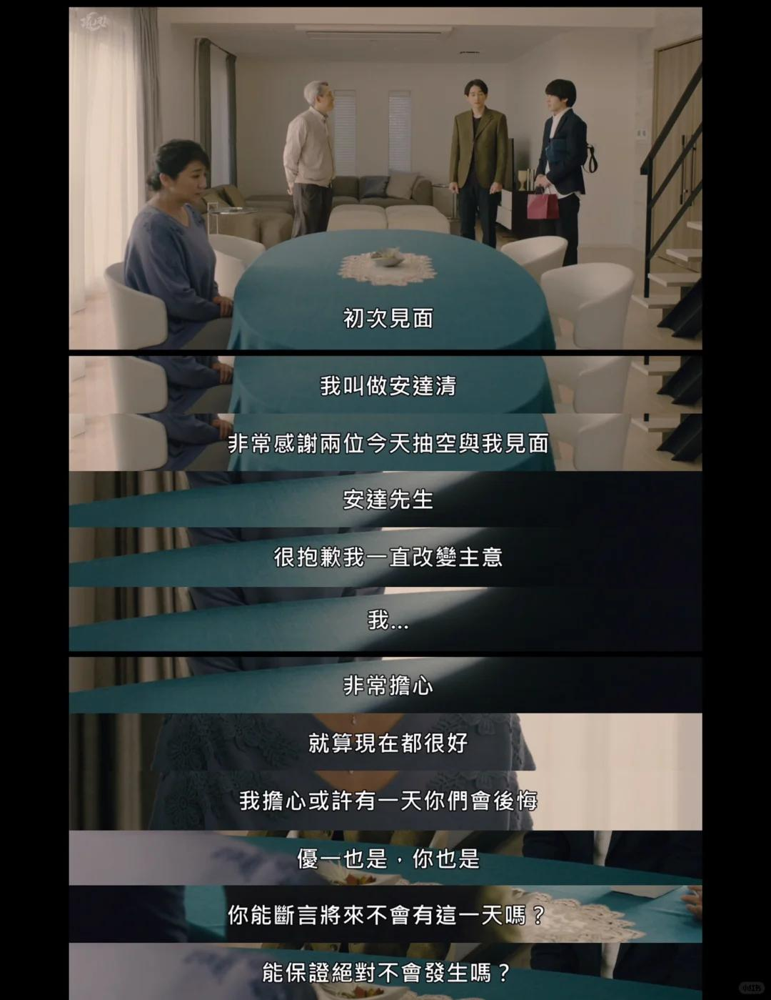
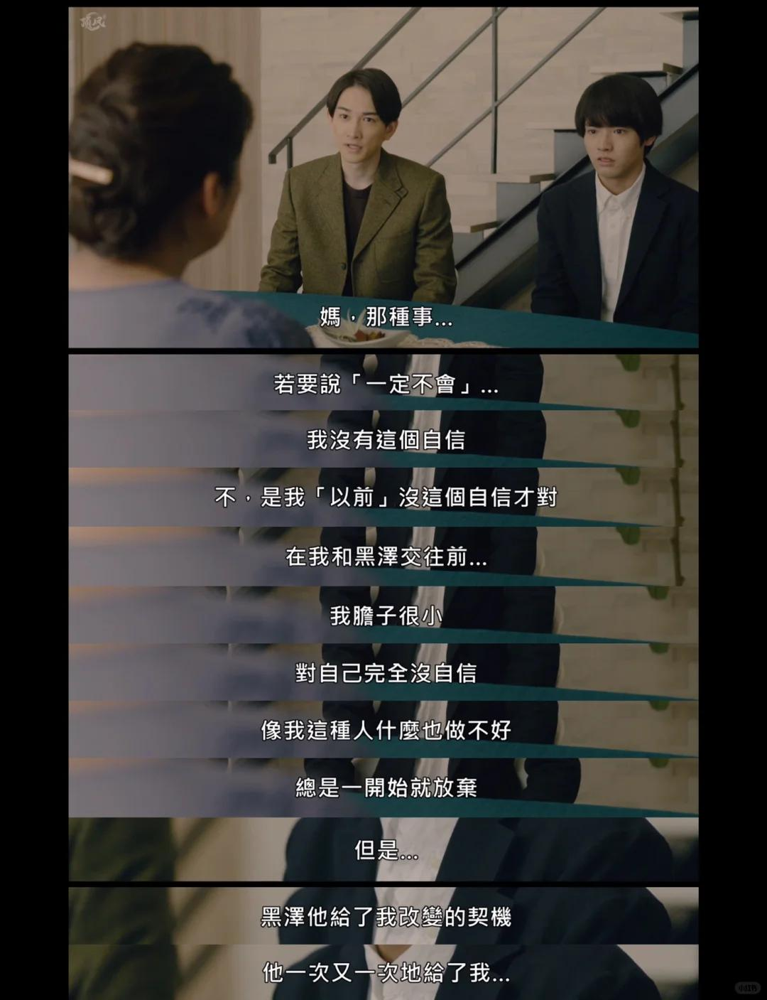
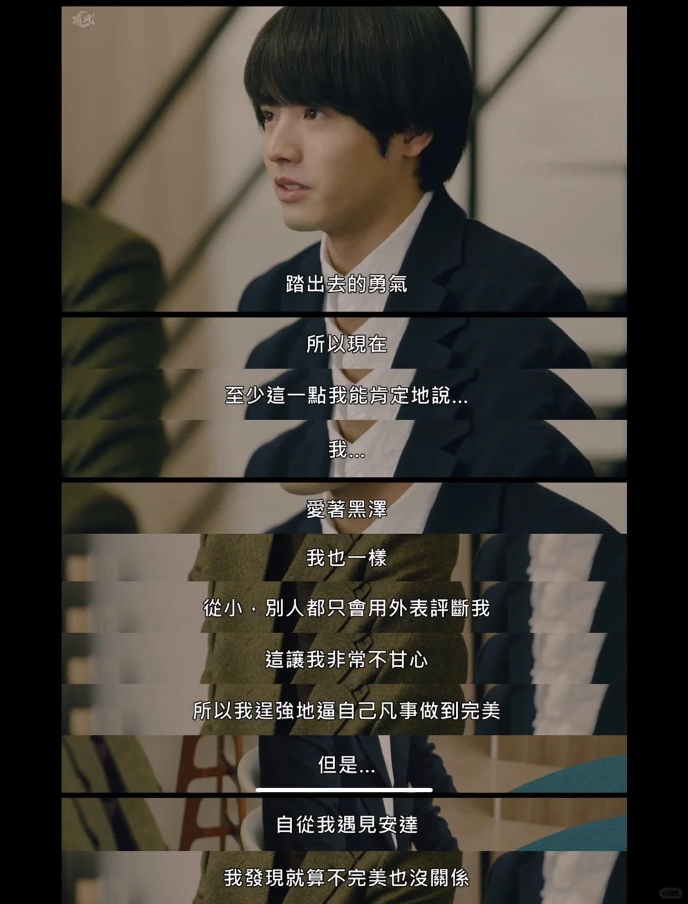
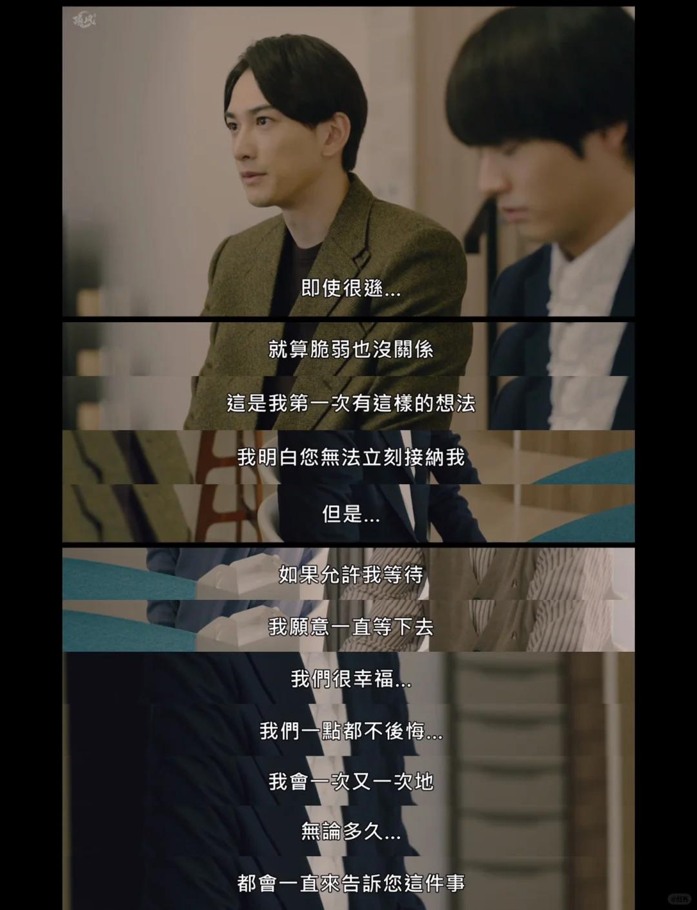
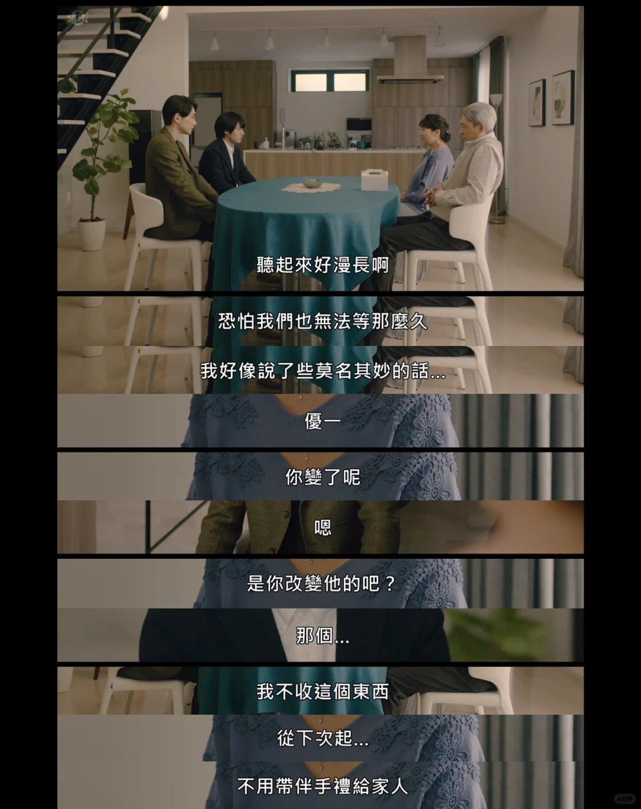

#到了三十岁还是处男会变成魔法师 #日腐 #bl #日剧 #町田启太 #赤楚卫二
非常温柔的一部剧，上周回家看的，町田启太和赤楚卫二，颜值很高演技很好剧情很棒，op和ed好听！电影是剧的延伸、今天晚上抽空看完了电影版，前面很甜后面感动，截取了里面的部分台词，分享记录
知道安达清受伤跑到长崎的黑泽优一，两个人第一次互相袒露真心，告诉对方自己真实的想法对那个个人的心意是要完整表达给对方，两个人都改变了！
安达一家对两个人的态度，太美好了，没有过多的言语，妈妈开心的笑容，爸爸认同的眼神，弟弟一家的祝福，晚上其乐融融的喝酒吃饭真的太好哭了
黑泽这里则不一样，妈妈从抗拒见面到愿意见面，再到见面时被两个的幸福感化，笑着落泪祝福，爸爸说得话太好了呀两边都是相信孩子的选择，只要幸福就好了，太好哭了！
黑泽和安达这段在妈妈面前的内心剖白，我泪流不止！安达成长了，之前都是靠魔法听见黑泽的心声，他很胆怯完全不敢相信那么优秀的黑泽会喜欢自己，他一次次靠魔法去确定感受对方的想法。可是魔法会失效，他开始靠自己。从自卑到自信，敢于开口敢于尝试敢于说爱，都是因为被黑泽坚定的选择着[泪]而黑泽一直以来压抑自己，内心的脆弱和不完美终于有一个人可以完全接受最真实的他！优一和清是双向奔赴的爱情，互相尊重理解，小心呵护对方的感情，在爱里坚强勇敢，一起努力成为更好的自己。看完久久不能平复，很清新很喜欢，不得不说日本真的很会拍纯爱