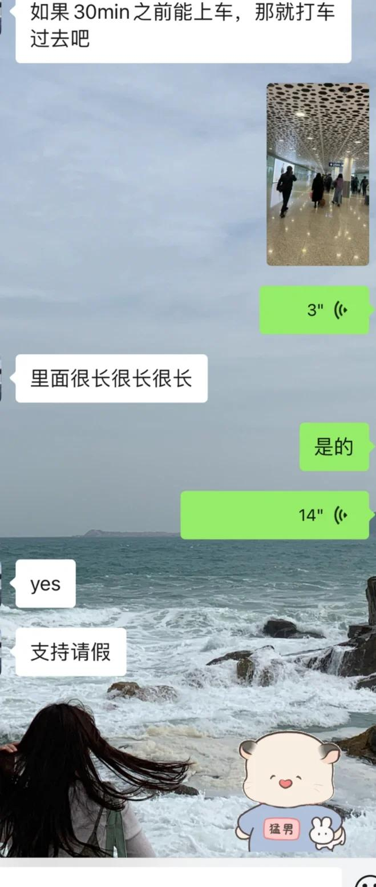
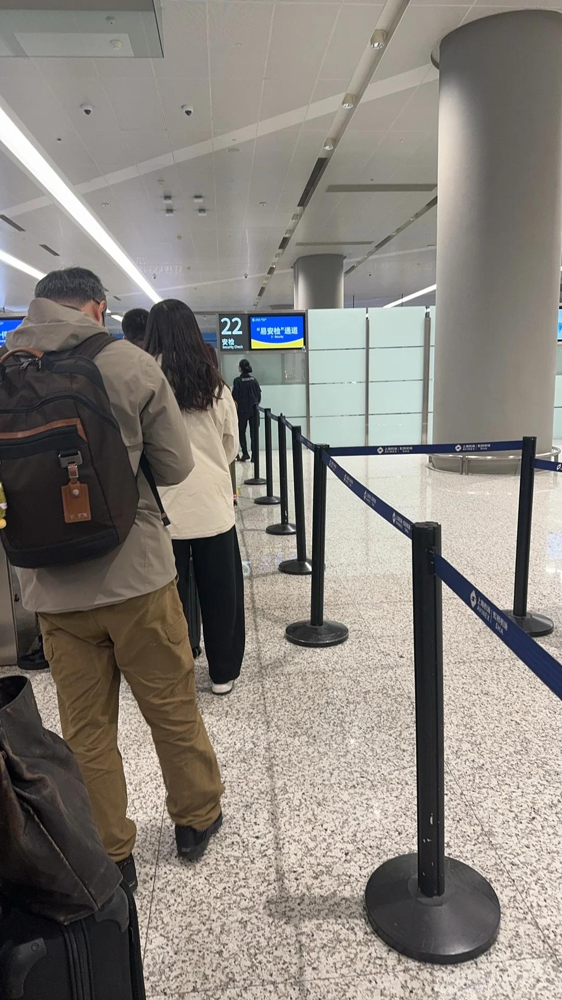
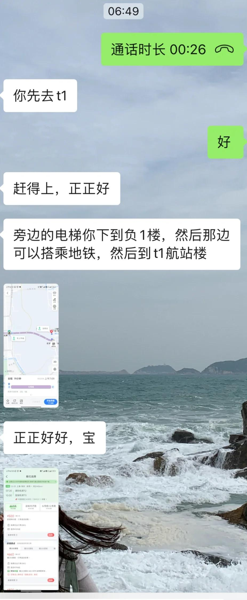
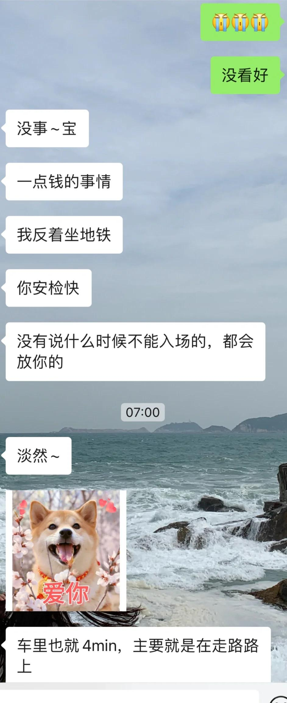
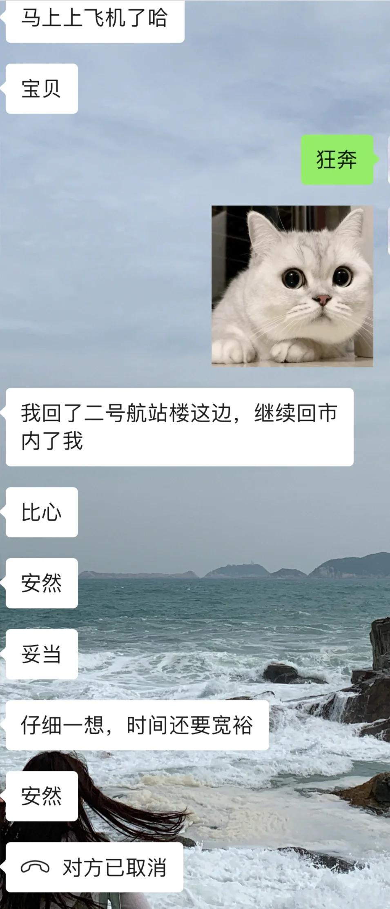
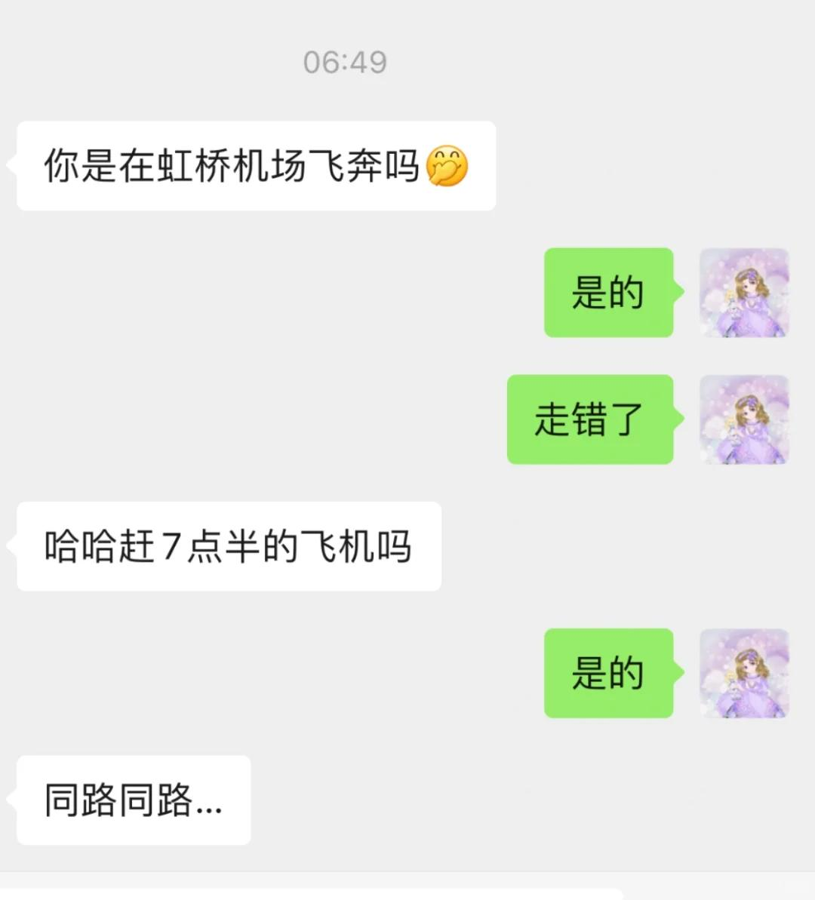

# 极限虹桥机场T2到T1登机

今天一整个大无语，第一次看错航站楼
五点多起床，六点十五左右就到了，
对象送我到机场两个人还温存了一会
想着易安检+线上值机肯定来得及，
在安检门口排队好一会发现进不去！！！
这个时候已经六点五十，七点半起飞，慌神了～
先问了机场工作人员怎么去T1，立马转弯下楼，
又遇到一个工作人员说来不及但是可以开车带我赶一下，
如果赶上飞机让我给【小费100！！！】更离谱
我怀疑不是机场人员，西装革履的不知道干啥～
还好指示牌提醒10号线一站即可到～相信官方YYDS
和男朋友打了个电话他也一直安抚我来得及，
帮我看路线，又防止我真的赶不上反着坐到T1等我
在地铁上搜xhs如何快速从地铁到T1，提供了很大帮助！
一路背着我的大包狂奔，后面真的走不动了
好在安检人员看到我已经开始登机让我走头等舱通道！
安检完毕一路小跑到登机口，广播传来我的名字
催我登机，笑死，第一次听到我名字……
最后紧赶慢赶，上了最后一辆摆渡车
登机时间七点十分！等最后一位小姐姐到十五发车，二十到飞机下～～真的太极限了！
《搞笑的是，还被合作方看到我在机场狂奔》
 
呜呜呜😭有一个情绪稳定，积极解决问题的对象真好，
我早上完全慌了～毕竟手机没赶上！一直陪着我～
————————————————————
但是落地深圳以后，飞机延误降落且下客慢，
廊桥位置太远了，机场太大走到打车地方十五分钟，
完全赶不上打卡了哈哈哈，索性早上又请假了！
回家以后洗澡洗头把假期的衣服洗完晒了，拖地～
 
我哭死，领导太关心我了，问了两个人我怎么还没来，
室友后面帮我转达飞机延误了
#虹桥机场 #宝安机场 #赶飞机 #极限登机 #上海 #深圳