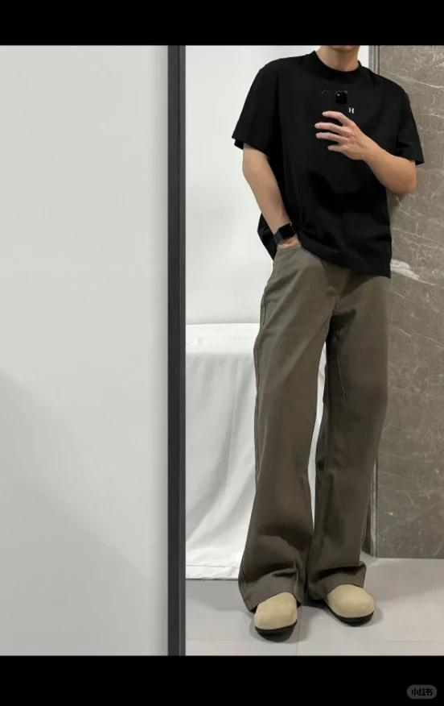
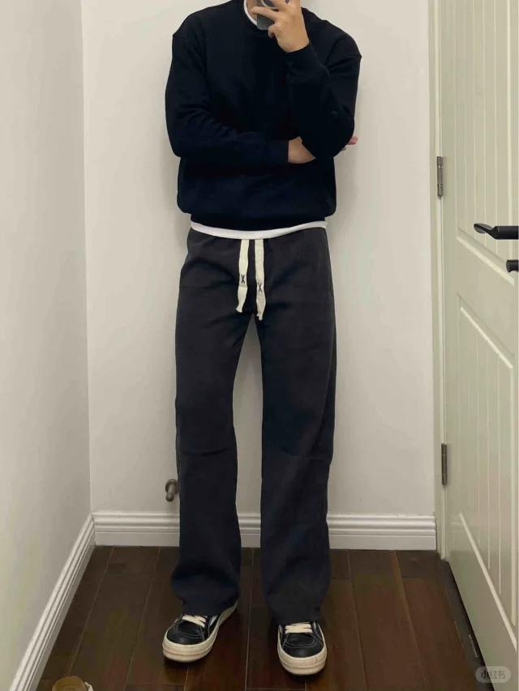

# 男生穿搭好难啊……丑的真丑，好看的真好看

看了一周男生衣服穿搭了，比女生难多了！！！
xhs/dw/tb都在逛，运动品牌+潮牌都库库看，虽然感觉男生可选择的款式其实比女生少很多！上衣（外套+内搭）+裤子，但是真的好难选！
看测评和分享，好看好看，一去店铺看实物图和买家秀，嗯？ 重点是不同身材类型穿起来感觉天差地别，让我无从下手！
不过最近知识库猛猛提升，因为之前我是不爱穿卫衣，现在研究以后，什么克重 含棉量 肩线位置 版型 连帽圆领开衫 风格 色系……打开大门！sorry，第一次了解卫裤，牛牛牛，我说为什么男生那么多束脚裤！直筒裤工装裤休闲裤微喇裤，瞬间感觉还是穿裙子方便我爱裙子！
总之，现在最好的办法是，抓着我男朋友去试衣服，哈哈哈，看看适合什么风格的衣服
#男生穿搭 #秋冬穿搭